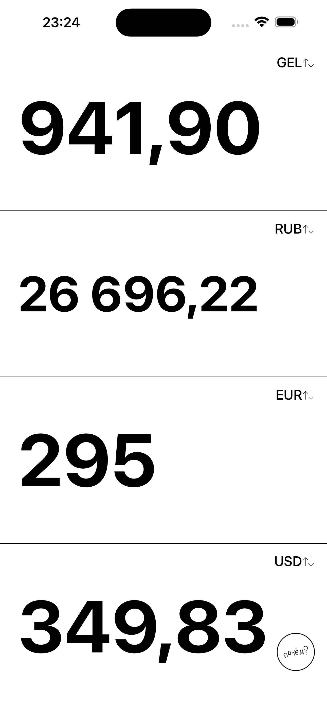
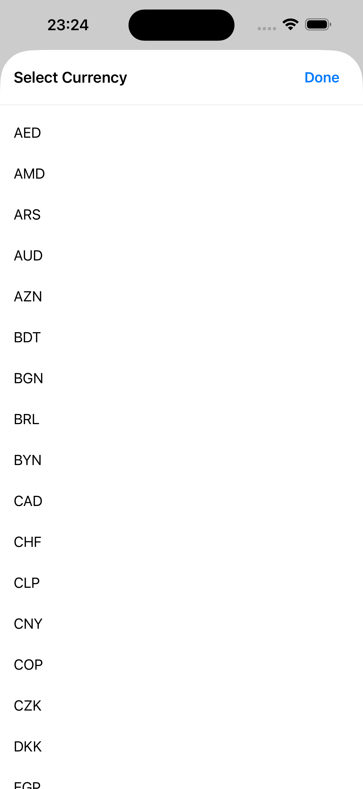

# почём (pochem)

Simple currency converter

|                                             |                                             |
|---------------------------------------------|---------------------------------------------|
|  |  |


## Getting Started

```bash
# Install dependencies
npm install

# Start Expo
npm start
```

After starting:
- Press `i` for iOS simulator
- Press `a` for Android emulator
- Scan QR code with Expo Go on your phone

## Native Build

```bash
# iOS simulator
npm run ios

# iOS on real device (dev)
npm run ios -- --device

# iOS on real device (release, works without dev server)
npm run ios -- --configuration Release --device

# Android
npm run android
```

If native folders are missing:
```bash
npm run prebuild
```

## Tech Stack

- Expo 54
- React Native 0.81
- MobX
- TypeScript

## Architecture

```
┌─────────────────────────────────────────────────────────┐
│  UI Layer (screens/, components/)                       │
│  - Screens and UI components                            │
│  - Only renders, no business logic                      │
│  - Calls store methods, observes state                  │
├─────────────────────────────────────────────────────────┤
│  Adapters (hooks/, controllers/)                        │
│  - Thin adapters between UI framework and stores        │
│  - useAuth(), useProfile(), etc.                        │
├─────────────────────────────────────────────────────────┤
│  Core (core/)                                           │
│  - Business logic lives here                            │
│  - Stores orchestrate everything                        │
│  - MUST be framework-agnostic                           │
│  - Could be extracted to CLI/API without changes        │
├─────────────────────────────────────────────────────────┤
│  Infrastructure (infrastructure/)                       │
│  - Implements ports (interfaces) from core              │
│  - Database adapters, external API adapters             │
│  - Can be swapped without touching business logic       │
└─────────────────────────────────────────────────────────┘
```

See [CLAUDE.md](./CLAUDE.md) for architecture details.

## Versioning

This project uses [CalVer](https://calver.org/) (`YY.MM.patch`). See [CHANGELOG.md](./CHANGELOG.md) for release history.

## Contributing

See [CONTRIBUTING.md](./CONTRIBUTING.md).
